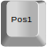
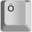
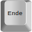
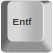

# Caps Lock Macros
## Motivation / Features
Using the Caps Lock key as shortcut in computer games under stock Windows is annoying. You never know if it's on or off without looking down at your keyboard or typing some test text.

This leads to the first functionality of the application: it disables the Caps Lock functionality.

But why not use the Caps Lock key as an macro key then? This is the main functionality of the application.

## Prerequisites

- Windows 10 64 bit
- [.NET Core](https://dotnet.microsoft.com/download) x64 runtime

## Installation

Download the latest release file and extract the contents to a folder of your choice (we'd suggest "C:\ProgramData\CapsLockMacros"). Basically the installation is done now. You can run the exe and use the application like it is.

## Autostart

We suggest that you set up autostart for the application (so that it always runs in the background):

1. Right click the exe, hover "Send to" and click "Create Desktop shortcut"
2. Then copy the shortcut file that has been created on your Desktop to "C:\Users\your_user_name\AppData\Roaming\Microsoft\Windows\Start Menu\Programs\Startup" (you can simply access this folder by hitting "Win key + R" and then running the command "shell:startup")

## Notify Icon

The application runs without a Window or Console. It's minimized in your tray icons. By right clicking the app icon in your tray icons you can pause the functionality of the application, exit the application or access the config file.

## Configuration

When you run the executable file for the first time, the default config file (stored in the installation directory) is created. The syntax of the JSON config file is quite simple. The input key is the key that should trigger the action in combination with the Caps Lock key being pressed. The output key is the key that the application will press when you press "Caps Lock + Input key".

**IMPORTANT:** The letter keys (A, B, C, ...) have to be in upper case in the config file.

## Default Configuration

+	executes	

+	executes	

+	executes	

+	executes	

+	executes	 or 

+	executes	 or  

+	executes	

+	executes	 or 

(Icons by [q2apro](https://github.com/q2apro): [repo](https://github.com/q2apro/keyboard-keys-speedflips))

## Possible Problems

The application is designed and tested for keyboards with german layout. There are umlaut keys like Ö, Ä and Ü in the german layout which are used in the default configuration. My advice for non-german users: edit the config file to match your layout. If you have an english layouted keyboard you may change the shortcut for "End" to the ";" key. 